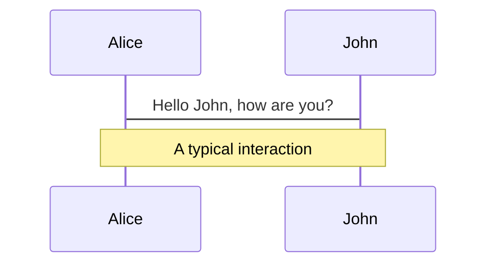
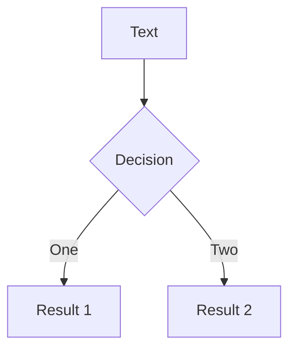
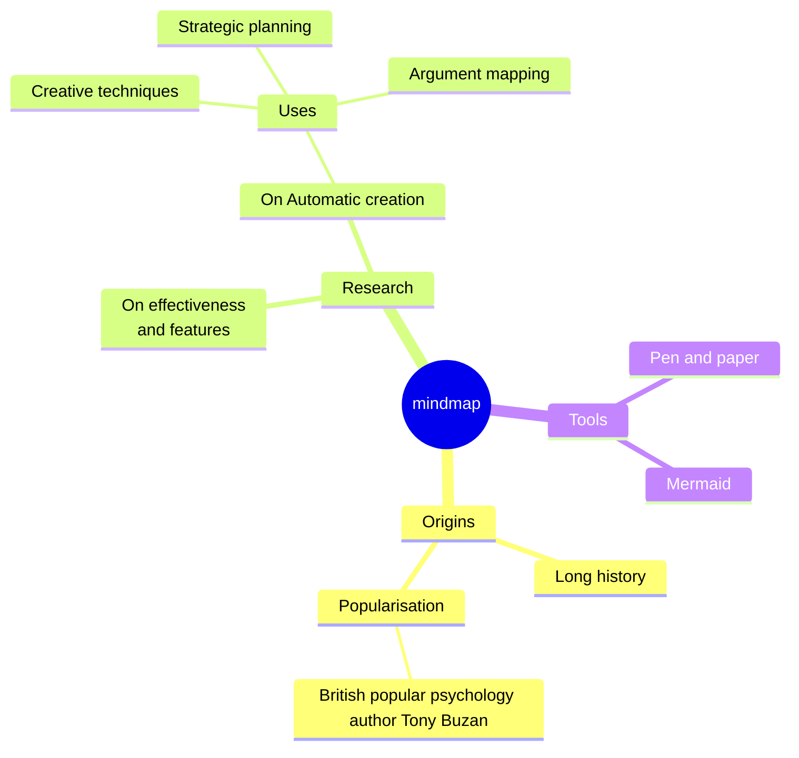
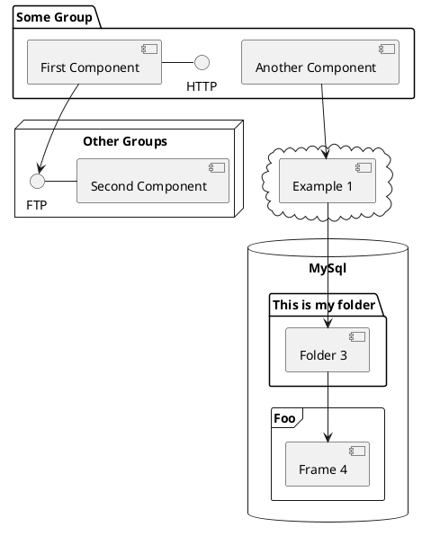

---
# try also 'default' to start simple
theme: seriph
themeConfig:
  primary: '#3179c6'
background: ''
# some information about your slides, markdown enabled
title: TS燒腦篇
info: typeScript 實戰應用解說
# apply any unocss classes to the current slide
class: text-center
# https://sli.dev/custom/highlighters.html
highlighter: shiki
# https://sli.dev/guide/drawing
drawings:
  persist: false
# slide transition: https://sli.dev/guide/animations#slide-transitions
transition: slide-left
# enable MDC Syntax: https://sli.dev/guide/syntax#mdc-syntax
mdc: true
---

<div class="text-6em text-sky-600"> TS 實戰應用篇</div>
<br>
<p class="text-trueGray-500 text-2xl">獻給那些因 TypeScript 而死的腦細胞</p>

---
transition: slide-left
---
<div class="text-3em text-center text-sky-600">寫TS之前</div>
  

---
transition: slide-left
---
<div class="text-3em text-center text-sky-600">寫TS期間</div>
  

---
transition: slide-left
---
<div class="text-3em text-center text-sky-600">寫TS之後</div>
  


---
transition: slide-left
---


<!-- 以下為示範 -->
<!-- 
轉場
transition: slide-up
transition: slide-left
transition: fade-out

// 頁面分割
layout: two-cols
layoutClass: gap-10

// 頁面部分分割
// <div grid="~ cols-2 gap-2" m="t-2">
</div>
 -->
<!-- ------------------------------------------- 大綱 ------------------------------------------ -->
---
transition: slide-left
---

<div class="text-2em text-sky-600">大綱</div>
<ul class="text-2em mt-5 font-mono space-y-5">
  <li> 遍歷物件(Iterate Object)
  </li>
  <li> 抓出特定型別的屬性值＆立即索引映射型別(IIMT)
  </li>
  <li> 移除所有為空值的屬性
  </li>
</ul>

---
transition: slide-left
---
<div class="text-2.5em text-sky-600 mt-2">遍歷物件(Iterate Object)</div>
<div grid="~ cols-2 gap-3" m="t-2">

  ```ts
  const webCase = ref({
    baseInfo:{...},
    areaInfo:{
      buildPin: null,
      buildSquareMetre: null,
      mainPin: null,
      mainSquareMetre: null,
      attachedPin: null,
      attachedSquareMetre: null,
      publicPin: null,
      publicSquareMetre: null,
    },
    communityInfo:{...},
    pictureInfo:{...},
    publishStateInfo:{...}
  })
  ```

  <div>
    <p v-click class="text-trueGray-500 text-xl mt-0!">單位切換時，清空 areaInfo 內所有屬性的 value</p>
    <a v-after href="https://007-s2.houseprice.tw/inventory/inventory-edit">007-s2 刊登頁</a>
    
  </div>
</div>

---
transition: slide-left
---

<div class="text-2.5em text-sky-600 mt-2">遍歷物件(Iterate Object) : JS</div>

<div grid="~ cols-2 gap-3" m="t-2">

<div class="mt-12">

  ```ts
   areaInfo:{
      buildPin: 12,
      buildSquareMetre: 22,
      mainPin: 12,
      mainSquareMetre: 34,
      attachedPin: 23,
      attachedSquareMetre: 12,
      publicPin: 56,
      publicSquareMetre: 678,
    }
  ```
</div>


  <div>
  <div v-click>
  <p class="text-2xl">for...in</p>

  ```js
  for(let key in areaInfo){
    areaInfo[key] = null
  }

  ```
  </div>

  <div v-click class="mt-2.5em">
    <p class="text-2xl">object.keys</p>

  ```js
  Object.keys(areaInfo).forEach((key)=>{
    areaInfo[key] = null
  })

  ```
  
  </div>


  </div>
</div>


---
transition: slide-left
---

<div class="text-2.5em text-sky-600 mt-2">遍歷物件(Iterate Object)：TS錯誤</div>

<div class="mt-10">

```ts twoslash
import {areaInfo} from './public/data/areaInfo'

Object.keys(areaInfo).forEach((key)=>{
  areaInfo[key] = null
})
```
</div>

<p class="text-1.6em text-white text-center bg-red-600 py-4 font-bold">TS程式設計中，Object.keys 返還的是字串陣列，而非屬性索引陣列</p>

---
transition: slide-left
---
<div class="text-2.5em text-sky-600 mt-2">解法一：強硬斷言as</div>
<br>
<br>

```ts {all|3,4|5,6,7} twoslash 
import { areaInfo } from './public/data/areaInfo'

const keys = Object.keys(areaInfo) as Array<keyof typeof areaInfo>;
// ['buildPin', 'buildSquareMetre', 'mainPin', ......]

keys.forEach((key)=>{
  areaInfo[key] = null
})
```

---
transition: slide-left
---

<div class="text-2.5em text-sky-600 mt-2">解法二：自訂ObjectKeys方法</div>
<br>


```ts {all|1|2|all}
const objectKeys = <T extends object>(obj: T): (keyof T)[] => {
  return Object.keys(obj) as (keyof T)[];
};

```

<br>


<div v-click>

```ts {} twoslash 
import { areaInfo } from './public/data/areaInfo'
import { objectKeys } from './snippets/objectKeys'

objectKeys(areaInfo).forEach(key => {
  areaInfo[key] = null
});
```
</div>


<!-- ------------------------------------------- 第二點 ------------------------------------------ -->
---
transition: slide-left
---
<div class="text-2.5em text-sky-600 mt-2">抓出指定型別的屬性值</div>
<div grid="~ cols-2 gap-4">

<div>

```ts{all|2,4}
type SomeObject = {
  a: string;
  b: number;
  c: string;
  d: boolean;
};

```
</div>

<div>

```ts{hide|all|1-6|8-10|8|9|10|all}
const Obj = {
  a: 'nsdfasdf';
  b: 12;
  c: 'wetwet';
  d: false;
}

type StringKeys<T> = {
  [K in keyof T]: T[K] extends string ? K : never;
}[keyof T];
 
type StringKeysOfObj = StringKeys<Obj>;

```

</div>

</div>

---
transition: slide-left
---
<div class="text-2.5em text-sky-600 mt-2">立即索引映射型別(IIMT)</div>
<p class="text-trueGray-500 text-2xl">Immediately Indexed Mapped Type</p>
<br>

```ts
type SomeObject = {
  a: string;
  b: number;
};

type IIMT = {
  [K in keyof SomeObject]: K;
}[keyof SomeObject];
```

---
transition: slide-left
---
<div class="text-2.5em text-sky-600 mt-2">立即索引映射型別(IIMT)</div>


```ts{all|6-7|6-7,10-14|8|16-17|all}
type SomeObject = {
  a: string;
  b: number;
};

type IIMT = {
  [K in keyof SomeObject]: K;
}[keyof SomeObject];

// 物件樣貌
{
  a: 'a',
  b: 'b'
}

// 物件樣貌
'a' | 'b'
```

<!-- ------------------------------------------- 第三點 ------------------------------------------ -->
---
transition: slide-left
---
<div class="text-2.5em text-sky-600 mt-2">移除所有為空值的屬性(動態)</div>

```ts
// 取出所有非空值的key
type NonNullablePropertyKeys<T> = {
  [P in keyof T]: T[P] extends null | undefined | '' ? never : P;
}[keyof T];

// 必填選項變成可選（optional），同時保持其餘可以為空值的屬性不變
type OptionalProperties<T> = Partial<Pick<T, NonNullablePropertyKeys<T>>> &
  Omit<T, NonNullablePropertyKeys<T>>;

// 遞迴遍歷槽狀物件，對每一層 NullablePropertiesOptional，讓深層物件中符合條件的屬性也變為可選
export type DeepOptionalProperties<T> = {
  [P in keyof T]: T[P] extends object ? DeepOptionalProperties<OptionalProperties<T[P]>> : T[P];
};

```

---
transition: slide-left
---
<div class="text-2.5em text-sky-600 mt-2">移除所有為空值的屬性(動態)：資料</div>
<br>
<div>

```ts
const InventoryWebCaseData = {
    baseInfo: {...};
    areaInfo: {...};
    contactInfo: {...};
    videoInfo: {...};
    pictureInfo: {...};
    communityInfo: {...};
    identityInfo: {...};
    publishStateInfo: {...};
    isExpired: {...};
  }
```
</div>


---
transition: slide-left
---
<div class="text-2.5em text-sky-600 mt-2">移除所有為空值的屬性(動態):功能</div>
<div grid="~ cols-2 gap-4">
<div>

```ts
// 物件包含必填以及可以為null的屬性
const InventoryWebCaseData = {
    baseInfo: {
      caseName: '測試物件'; // 必填
      purPoseName: null;
      caseType: '土地'; // 必填
    };
    areaInfo: {
      buildPin: 122;
      buildSquareMetre: null;
      mainPin: 23;
      mainSquareMetre:null;
      attachedPin: 32;
      attachedSquareMetre: null;
    };
    pictureInfo {
      casePhotoList: ['http://fsfsdfgsd',
      'http://fsfsdfgsd'];
      patternPictureList: [];
    }
    ...
  }
```
</div>


<div v-click>

```ts
const InventoryWebCaseData = {
    baseInfo: {
      caseName: '測試物件';
      caseType: '土地';
    };
    areaInfo: {
      buildPin: 122;
      mainPin: 23;
      attachedPin: 32;
    };
    pictureInfo {
      casePhotoList:['http://fsfsdfgsd',
      'http://fsfsdfgsd'];
    }
    ...
  }
```
</div>

</div>


---
transition: slide-left
---
<div class="text-2.5em text-sky-600 mt-2">移除所有為空值的屬性(動態):功能</div>

```js
// 移除params空值或未填值
const setParamsConds = object => {
  const obj = structureClone(object);

  for (let dataCategory in obj) {
    for (let key in obj[dataCategory]) {
      // boolean 的 false 不可濾掉
      if (typeof obj[dataCategory][key] !== 'boolean') {
        if (!obj[dataCategory][key] || obj[dataCategory][key].length === 0) {
          // 屋齡的 0 視為判斷屋齡不詳，非未填值
          key !== 'buildAge' ? delete obj[dataCategory][key] : null;
        }
      }
    }
  }
  return obj;
};
```


---
transition: slide-left
---
<div class="text-2.5em text-sky-600 mt-2">TS困難點：</div>
<div class="text-2em text-sky-600 mt-2">能否動態改變型別，濾掉資料為空值的屬性？</div>

<br>
<br>
<br>
<p class=" text-1.8em text-white text-center bg-red-600 py-4 font-bold">TypeScript 不直接支援根據運行時的條件動態更改型別類型</p>

---
transition: slide-left
---
<div class="text-2.5em text-sky-600 mt-2">解法一:Partial</div>
<p class="text-trueGray-500 text-2xl">
   <a href="https://www.typescriptlang.org/docs/handbook/utility-types.html#partialtype">Partial</a>
</p>

```ts
type Partial<T> = {
  [P in keyof T]?: T[P];
};
```

---
transition: slide-left
---
<div class="text-2.5em text-sky-600 mt-2">解法二:自訂 NonNullableProperty</div>

```ts{all|1,2,3,4|6,9|7,10|8,9,10|12-15|all}
// 取出所有非空值的key
type NonNullablePropertyKeys<T> = {
  [P in keyof T]: T[P] extends null | undefined | '' ? never : P;
}[keyof T];

// 將非空值的選項轉為可選
// 跳過非空值的選項
// 結和兩個條件建立新類型，把可以為 null、undefined 或空字符串的屬性變為可選，其餘屬性保持原樣
type OptionalProperties<T> = Partial<Pick<T, NonNullablePropertyKeys<T>>> &
  Omit<T, NonNullablePropertyKeys<T>>;

// 遞迴遍歷槽狀物件，對每一層 NullablePropertiesOptional，讓深層物件中符合條件的屬性也變為可選
export type DeepOptionalProperties<T> = {
  [P in keyof T]: T[P] extends object ? DeepOptionalProperties<OptionalProperties<T[P]>> : T[P];
};

```

---
transition: slide-left
---
<div class="text-2.5em text-sky-600 mt-2">OptionalProperties解說</div>

<div grid="~ cols-2 gap-4">
<div>

```ts
interface Employee {
  id: number;
  name: string;
  department: string | null;
  email: string | null;
}

// 新類型
// id 和 name 變成可選
// 保留 department 和 email為 null 的特性
type UpdatedEmployee = {
  id?: number;
  name?: string;
  department: string | null;
  email: string | null;
}
```
</div>

<div>

```ts
Partial<Pick<T, NonNullablePropertyKeys<T>>>
{
  id?: number;
  name?: string;
}

Omit<T, NonNullablePropertyKeys<T>>;
{
  department: string | null;
  email: string | null;
}

兩個類型使用&連及後
 {
  id?: number;
  name?: string;
  department: string | null;
  email: string | null;
}

```
</div>

</div>

<!-- ------------------------------------------- END ------------------------------------------ -->
---
transition: slide-up
level: 2
---

# Navigation

Hover on the bottom-left corner to see the navigation's controls panel, [learn more](https://sli.dev/guide/navigation.html)

## Keyboard Shortcuts

|     |     |
| --- | --- |
| <kbd>right</kbd> / <kbd>space</kbd>| next animation or slide |
| <kbd>left</kbd>  / <kbd>shift</kbd><kbd>space</kbd> | previous animation or slide |
| <kbd>up</kbd> | previous slide |
| <kbd>down</kbd> | next slide |

<!-- https://sli.dev/guide/animations.html#click-animations -->

<p v-after class="absolute bottom-23 left-45 opacity-30 transform -rotate-10">Here!</p>

---
layout: two-cols
layoutClass: gap-16
---

# Table of contents

You can use the `Toc` component to generate a table of contents for your slides:

```html
<Toc minDepth="1" maxDepth="1"></Toc>
```

The title will be inferred from your slide content, or you can override it with `title` and `level` in your frontmatter.

::right::

<Toc v-click minDepth="1" maxDepth="2"></Toc>

---
layout: image-right
image: https://cover.sli.dev
---

# Code

Use code snippets and get the highlighting directly, and even types hover![^1]

```ts {all|5|7|7-8|10|all} twoslash
// TwoSlash enables TypeScript hover information
// and errors in markdown code blocks
// More at https://shiki.style/packages/twoslash

import { computed, ref } from 'vue'

const count = ref(0)
const doubled = computed(() => count.value * 2)

doubled.value = 2
```

<arrow v-click="[4, 5]" x1="350" y1="310" x2="195" y2="334" color="#953" width="2" arrowSize="1" />

<!-- This allow you to embed external code blocks -->
<<< @/snippets/external.ts#snippet

<!-- Footer -->
[^1]: [Learn More](https://sli.dev/guide/syntax.html#line-highlighting)

<!-- Inline style -->
<style>
.footnotes-sep {
  @apply mt-5 opacity-10;
}
.footnotes {
  @apply text-sm opacity-75;
}
.footnote-backref {
  display: none;
}
</style>

<!--
Notes can also sync with clicks

[click] This will be highlighted after the first click

[click] Highlighted with `count = ref(0)`

[click:3] Last click (skip two clicks)
-->

---
level: 2
---

# Shiki Magic Move

Powered by [shiki-magic-move](https://shiki-magic-move.netlify.app/), Slidev supports animations across multiple code snippets.

Add multiple code blocks and wrap them with <code>````md magic-move</code> (four backticks) to enable the magic move. For example:

````md magic-move
```ts {*|2|*}
// step 1
const author = reactive({
  name: 'John Doe',
  books: [
    'Vue 2 - Advanced Guide',
    'Vue 3 - Basic Guide',
    'Vue 4 - The Mystery'
  ]
})
```

```ts {*|1-2|3-4|3-4,8}
// step 2
export default {
  data() {
    return {
      author: {
        name: 'John Doe',
        books: [
          'Vue 2 - Advanced Guide',
          'Vue 3 - Basic Guide',
          'Vue 4 - The Mystery'
        ]
      }
    }
  }
}
```

```ts
// step 3
export default {
  data: () => ({
    author: {
      name: 'John Doe',
      books: [
        'Vue 2 - Advanced Guide',
        'Vue 3 - Basic Guide',
        'Vue 4 - The Mystery'
      ]
    }
  })
}
```

Non-code blocks are ignored.

```vue
<!-- step 4 -->
<script setup>
const author = {
  name: 'John Doe',
  books: [
    'Vue 2 - Advanced Guide',
    'Vue 3 - Basic Guide',
    'Vue 4 - The Mystery'
  ]
}
</script>
```
````

---

# Components

<div grid="~ cols-2 gap-4">
<div>

You can use Vue components directly inside your slides.

We have provided a few built-in components like `<Tweet/>` and `<Youtube/>` that you can use directly. And adding your custom components is also super easy.

```html
<Counter :count="10" />
```

<!-- ./components/Counter.vue -->
<Counter :count="10" m="t-4" />

Check out [the guides](https://sli.dev/builtin/components.html) for more.

</div>
<div>

```html
<Tweet id="1390115482657726468" />
```

<Tweet id="1390115482657726468" scale="0.65" />

</div>
</div>

<!--
Presenter note with **bold**, *italic*, and ~~striked~~ text.

Also, HTML elements are valid:
<div class="flex w-full">
  <span style="flex-grow: 1;">Left content</span>
  <span>Right content</span>
</div>
-->

---
class: px-20
---

# Themes

Slidev comes with powerful theming support. Themes can provide styles, layouts, components, or even configurations for tools. Switching between themes by just **one edit** in your frontmatter:

<div grid="~ cols-2 gap-2" m="t-2">

```yaml
---
theme: default
---
```

```yaml
---
theme: seriph
---
```


</div>

Read more about [How to use a theme](https://sli.dev/themes/use.html) and
check out the [Awesome Themes Gallery](https://sli.dev/themes/gallery.html).

---

# Clicks Animations

You can add `v-click` to elements to add a click animation.

<div v-click>

This shows up when you click the slide:

```html
<div v-click>This shows up when you click the slide.</div>
```

</div>

<br>

<v-click>

The <span v-mark.red="3"><code>v-mark</code> directive</span>
also allows you to add
<span v-mark.circle.orange="4">inline marks</span>
, powered by [Rough Notation](https://roughnotation.com/):

```html
<span v-mark.underline.orange>inline markers</span>
```

</v-click>

<div mt-20 v-click>

[Learn More](https://sli.dev/guide/animations#click-animations)

</div>

---
preload: false
---

# Motions

Motion animations are powered by [@vueuse/motion](https://motion.vueuse.org/), triggered by `v-motion` directive.

```html
<div
  v-motion
  :initial="{ x: -80 }"
  :enter="{ x: 0 }">
  Slidev
</div>
```

<div class="w-60 relative mt-6">
  <div class="relative w-40 h-40">
    
    
    
  </div>

  <div
    class="text-5xl absolute top-14 left-40 text-[#2B90B6] -z-1"
    v-motion
    :initial="{ x: -80, opacity: 0}"
    :enter="{ x: 0, opacity: 1, transition: { delay: 2000, duration: 1000 } }">
    Slidev
  </div>
</div>

<!-- vue script setup scripts can be directly used in markdown, and will only affects current page -->
<script setup lang="ts">
const final = {
  x: 0,
  y: 0,
  rotate: 0,
  scale: 1,
  transition: {
    type: 'spring',
    damping: 10,
    stiffness: 20,
    mass: 2
  }
}
</script>

<div
  v-motion
  :initial="{ x:35, y: 40, opacity: 0}"
  :enter="{ y: 0, opacity: 1, transition: { delay: 3500 } }">

[Learn More](https://sli.dev/guide/animations.html#motion)

</div>

---

# LaTeX

LaTeX is supported out-of-box powered by [KaTeX](https://katex.org/).

<br>

Inline $\sqrt{3x-1}+(1+x)^2$

Block
$$ {1|3|all}
\begin{array}{c}

\nabla \times \vec{\mathbf{B}} -\, \frac1c\, \frac{\partial\vec{\mathbf{E}}}{\partial t} &
= \frac{4\pi}{c}\vec{\mathbf{j}}    \nabla \cdot \vec{\mathbf{E}} & = 4 \pi \rho \\

\nabla \times \vec{\mathbf{E}}\, +\, \frac1c\, \frac{\partial\vec{\mathbf{B}}}{\partial t} & = \vec{\mathbf{0}} \\

\nabla \cdot \vec{\mathbf{B}} & = 0

\end{array}
$$

<br>

[Learn more](https://sli.dev/guide/syntax#latex)

---

# Diagrams

You can create diagrams / graphs from textual descriptions, directly in your Markdown.

<div class="grid grid-cols-4 gap-5 pt-4 -mb-6">









</div>

[Learn More](https://sli.dev/guide/syntax.html#diagrams)

---
src: ./pages/multiple-entries.md
hide: false
---

---

# Monaco Editor

Slidev provides built-in Moanco Editor support.

Add `{monaco}` to the code block to turn it into an editor:

```ts {monaco}
import { ref } from 'vue'
import hello from './external'

const code = ref('const a = 1')
hello()
```

Use `{monaco-run}` to create an editor that can execute the code directly in the slide:

```ts {monaco-run}
function fibonacci(n: number): number {
  return n <= 1
    ? n
    : fibonacci(n - 1) + fibonacci(n - 2) // you know, this is NOT the best way to do it :P
}

console.log(Array.from({ length: 10 }, (_, i) => fibonacci(i + 1)))
```

---
layout: center
class: text-center
---

# Learn More

[Documentations](https://sli.dev) · [GitHub](https://github.com/slidevjs/slidev) · [Showcases](https://sli.dev/showcases.html)
